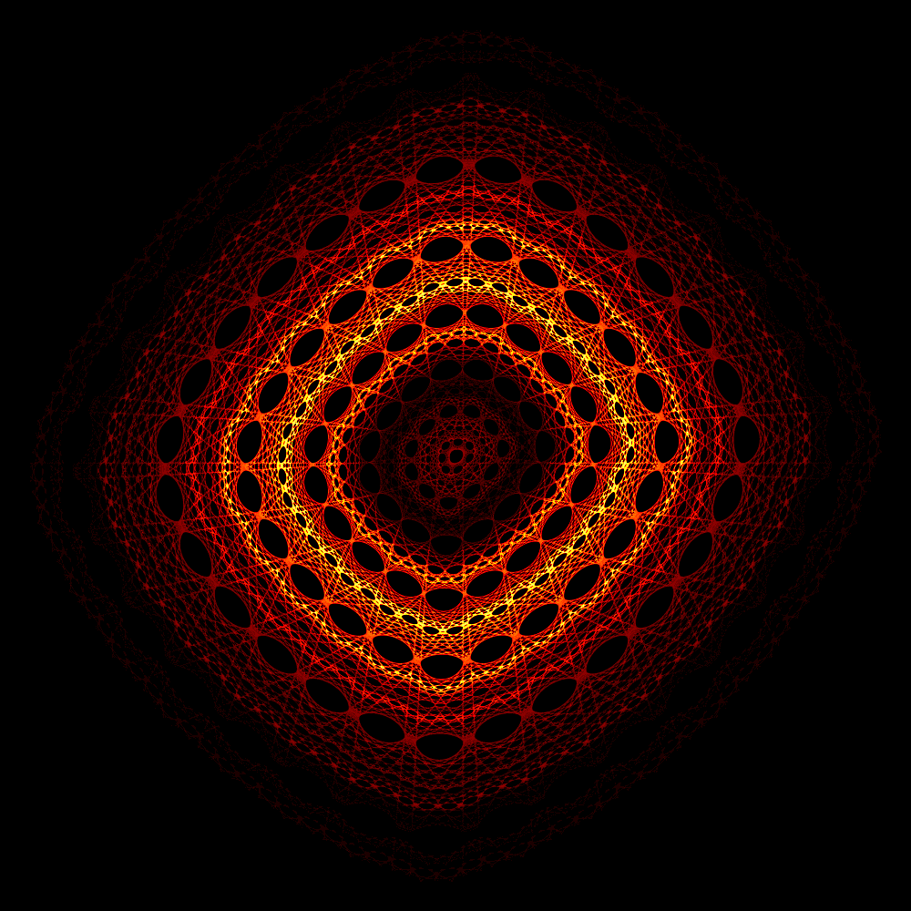

<!-- markdownlint-disable MD033 -->
# Calculate & Visualize the Hopalong Attractor with Rust

## Abstract

### Historical Context

The "*Hopalong*"<top>*<top> attractor, authored by Barry Martin of Aston University in Birmingham, England [[2](#references)],  
was popularized by A.K. Dewdney in the September 1986 issue of *Scientific American*. It gained further notoriety in Germany through an algorithm called *“HÜPFER”* in *Spektrum der Wissenschaft* [[3](#references)].  
*Nicknamed by A.K. Dewdney.  

### The Hopalong Attractor Functions

This Rust program computes and visualizes the “hopalong” attractor by iterating the following system of recursive functions:

$$
\large
\begin{cases}
x_{n+1} = y_n - \text{sgn}(x_n) \sqrt{\lvert b x_n - c \rvert} \\
y_{n+1} = a - x_n
\end{cases}
\large
$$

Where:

- The sequence starts from the initial point (x0 , y0) = (0 , 0)
- xn and yn represent the coordinates at the n-th iteration
- a, b, and c are parameters influencing the attractor's dynamics
- *sgn* is the *signum* function

### Features and Further Information

The color scheme is based on the pixel density, i.e. how often a pixel of the image is hit during the iteration.

For more information in general and about “pixel density”, i.e. displaying the attractor as a density heatmap, see my Python versions repository.

<https://github.com/ratwolfzero/hopalong_python>

For information on the implementation of the Signum function in Rust, see:
  
<https://docs.rs/num-traits/latest/num_traits/sign/fn.signum.html>

You can run this program from the command line in a terminal.

The number of iterations (num) can be entered as integer or in exponential form such as 1e6.  

Example: ./hopalong -2 -0.33 0.01 2e8 (MacOS)

If you are using a Mac with Apple Silicon you should be able to use the executable in the 'Binary' folder.  

The binary was compiled on a Mac Mini with M2 processor.  
The calculated image should be displayed but there will be an error regarding saving the image.

    // Save the image with the generated name
    let save_path = format!("/Users/ralf//Projects/hopalong_pictures/{}", image_name); // Specify your desired save path
    if let Err(e) = image_buffer.save_with_format(&save_path, ImageFormat::Png) {
        eprintln!("Error saving image: {}", e);
    } else {
        println!("Image saved to: {}", save_path);
    }

----------------------------------------------------------------------------------------------------------------------------------------------------

## References

[1]  
**J. Lansdown and R. A. Earnshaw (eds.)**, *Computers in Art, Design and Animation*.  
 New York: Springer-Verlag, 1989.  
 e-ISBN-13: 978-1-4612-4538-4.  

[2]  
**Barry Martin**, "Graphic Potential of Recursive Functions," in *Computers in Art, Design and Animation* [1],  
pp. 109–129.

[3]  
**A.K. Dewdney**, *Psychotapeten*, Algorithm *"HÜPFER"*, in *Spektrum der Wissenschaft: Computer Kurzweil*.  
Spektrum der Wissenschaft Verlagsgesellschaft mbH & Co., Heidelberg, 1988.  
(German version of *Scientific American*).  
ISBN-10: 3922508502, ISBN-13: 978-3922508502.
